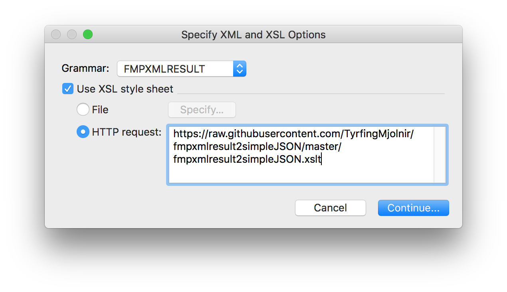
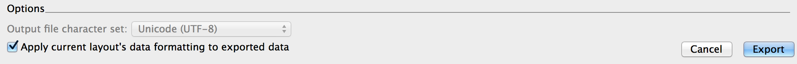

# fmpxmlresult2simpleJSON
This is an XSLT stylesheet to convert from FileMaker's fmpxmlresult to JSON simple table data.

This is a PoC( Proof of Concept )

Uses string for all datatypes.

Note that adding a layout name in the FMPXMLRESULT export; before translating using this XSLT, will make the output more complete. FileMaker does usually skip layout name on exports, if you know when FileMaker actually outputs the layout name, please enlighten me.

### There is now need to download the stylesheet from github, 1) click on the stylesheet; 2) click Raw, 3) copy the URL and 4) paste into the XSLT HTTP dialog of FileMaker XML export



## Make sure you check the box below to make this stylesheet work.



How to use this file in terminal
---
```BASh
xsltproc fmpxmlresult2simpleJSON.xslt YourLayout.fmpxmlresult.xml | json
```
```JSON
{
  "layoutname": {
    "field": [
      "fieldname1",
      "fieldname2",
      "fieldname3"
    ],
    "data": {
      "recidrecord1.modidrecord1": [
        "field1content",
        "field2content",
        "field3content"
      ],
      "recidrecord2.modidrecord2": [
        "field1content",
        "field2content",
        "field3content"
      ]
    }
  }
}
```

License
=======

Copyright (c) 2018 Gjermund Gusland Thorsen, released under the MIT License.

All rights deserved.

Permission is hereby granted, free of charge, to any person obtaining a copy of this software and associated documentation files (the "Software"), to deal in the Software without restriction, including without limitation the rights to use, copy, modify, merge, publish, distribute, sublicense, and/or sell copies of the Software, and to permit persons to whom the Software is furnished to do so, subject to the following conditions:

The above copyright notice and this permission notice shall be included in all copies or substantial portions of the Software.

This piece of software comes with ABSOLUTELY NO WARRANTY, to the extent permitted by applicable law.
